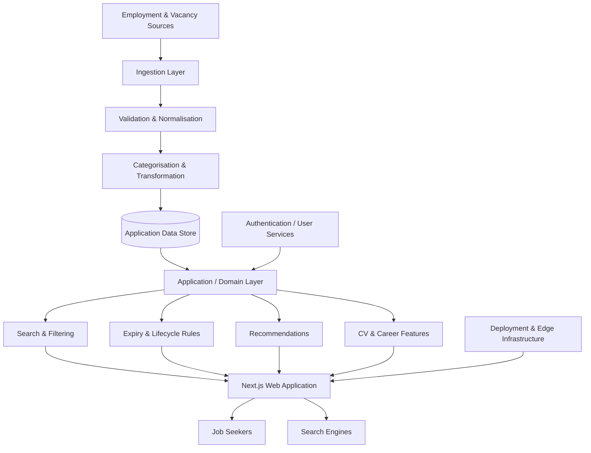
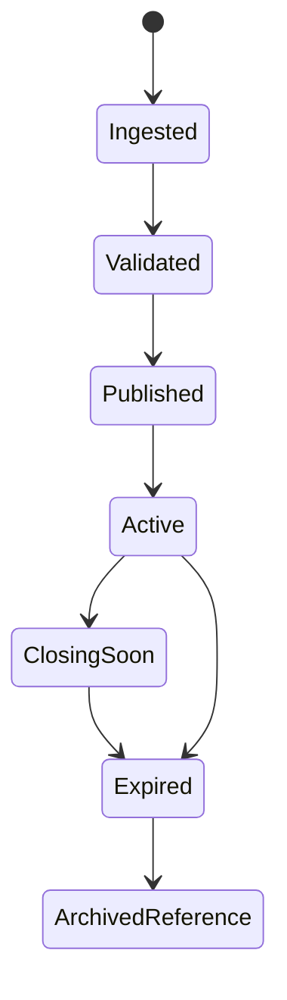

# Employment Echo — Engineering Case Study

> A production employment-discovery platform for the South African job market.

[Live Platform](https://employmentecho.co.za/) · [LinkedIn](https://www.linkedin.com/in/maqoba-jiyane)

## Production Impact

| Metric | Result |
|---|---:|
| Google Search impressions | **1.01M+** |
| Organic search clicks | **91.1K+** |
| Average organic CTR | **9%** |
| Average Google Search position | **8.1** |
| Google-indexed pages | **946** |

*Search metrics are from Google Search Console and reflect platform performance as of August 2026.*

---

## Overview

Employment Echo is a South African employment technology platform that helps job seekers discover jobs, internships, learnerships, graduate programmes and related career resources.

I architected, developed and operate the platform end-to-end. My responsibilities span backend engineering, data modelling, vacancy ingestion and transformation, search and filtering, content lifecycle rules, SEO-oriented application architecture, production deployment, troubleshooting and ongoing optimisation.

Employment Echo is an actively operated platform. Its production source code is private.

---

## The Problem

Employment opportunities are published across many employers, recruitment platforms and public-sector sources. The information is often inconsistent in structure, terminology, dates and application instructions.

The engineering problem is therefore larger than rendering vacancy cards. The platform needs to:

- transform inconsistent source information into a predictable internal model;
- keep time-sensitive opportunities discoverable while removing stale results from active feeds;
- support useful search, filtering and categorisation;
- generate crawlable, indexable pages at scale;
- remain performant as the content footprint grows;
- support continuous production changes without disrupting job seekers.

---

## My Role

**Software Engineer — architecture, backend, product and production ownership**

I am responsible for:

- application architecture and technical direction;
- backend workflows and business rules;
- vacancy ingestion, validation, transformation and categorisation;
- database modelling and query design;
- search, filtering and recommendation logic;
- dynamic vacancy lifecycle handling;
- production debugging and deployment;
- SEO-oriented route and content architecture;
- ongoing performance and maintainability improvements.

---

## High-Level Architecture

The diagram intentionally stays at system level and excludes proprietary implementation details.



### Current Production Stack

| Area | Technology |
|---|---|
| Application | Next.js, React, TypeScript |
| Backend | Next.js server-side application logic / Node.js runtime |
| Data access | Prisma |
| Database | MongoDB Atlas |
| Authentication | Clerk |
| Deployment | Vercel |
| Edge / DNS / delivery | Cloudflare |
| Search performance measurement | Google Search Console |
| Version control | Git / GitHub |

---

## Core Engineering Challenges

### 1. Normalising inconsistent vacancy data

Vacancy sources do not expose one shared schema. Titles, employers, locations, closing dates, requirements, responsibilities and application instructions can differ significantly between sources.

**Approach**

I designed a canonical internal vacancy model and transformation workflow so downstream application features operate on predictable data instead of source-specific formats.

The ingestion process conceptually performs:

```text
Source data
   ↓
Extraction
   ↓
Validation
   ↓
Normalisation
   ↓
Categorisation
   ↓
Application-ready vacancy
```

**Result**

Search, filtering, routing and presentation can work against a consistent domain model even when the original vacancy information is inconsistent.

---

### 2. Managing time-sensitive content

Employment listings have a limited useful lifetime. A platform can quickly become untrustworthy if expired opportunities continue appearing alongside active opportunities.

**Approach**

I implemented application-level lifecycle rules around closing dates and recently added opportunities, then applied those rules across discovery and recommendation surfaces.

This required careful handling of:

- optional closing dates;
- date boundaries;
- South African time;
- recently published opportunities;
- expired content that may still need a public page for reference or search-engine handling.

**Result**

The platform can separate active discovery from the broader historical/content footprint instead of treating every stored vacancy as permanently active.

---

### 3. Scaling organic discoverability

Employment search is highly intent-driven. Users search by employer, qualification, province, city, department, experience level and opportunity type.

**Approach**

I built the platform around indexable, structured discovery routes rather than relying only on a single client-side search interface.

The architecture supports content groupings such as:

- jobs, internships, learnerships and graduate programmes;
- government opportunities;
- location-based discovery;
- qualification-based discovery;
- employer and department-oriented content;
- time-sensitive vacancy pages.

**Result**

The platform reached **1.01M+ Google Search impressions**, **91.1K+ organic clicks**, approximately **9% CTR**, an average search position of **8.1**, and **946 indexed pages**.

---

### 4. Keeping a growing content platform maintainable

As the number of routes, filters and content types grows, duplication and loosely defined business rules become increasingly expensive.

**Approach**

I separate reusable domain rules from page-level presentation wherever practical and use typed application models to keep filtering, categorisation and lifecycle behaviour consistent.

Key concerns include:

- reusable query logic;
- consistent date handling;
- shared category rules;
- predictable data transformation;
- keeping server-side and client-side behaviour aligned.

---

### 5. Operating the software after deployment

Employment Echo is not a demo project. Production ownership includes handling real data quality issues, crawl behaviour, expired content, failed assumptions and changes in upstream vacancy sources.

That work has required:

- debugging production issues;
- correcting data and source mappings;
- maintaining deployment reliability;
- monitoring search/index behaviour;
- improving query and caching strategies;
- iterating on information architecture as the platform grows.

---

## Example Domain Flow

A simplified vacancy lifecycle:



The exact production implementation is intentionally not disclosed.

---

## Product Surfaces Supported by the Architecture

The system supports multiple user journeys from the same underlying employment data:

- individual vacancy pages;
- all-jobs discovery;
- internships, learnerships and graduate opportunities;
- government-job discovery;
- qualification and location routes;
- search and filtering;
- related/similar opportunity discovery;
- CV and career resources.

The value of the architecture is not any single page. It is the ability to reuse structured employment data across multiple discovery paths without maintaining separate datasets.

---

## Engineering Decisions

### Canonical data model over source-specific rendering

I chose to transform vacancy information into a stable internal model rather than letting every source shape leak into application code.

**Trade-off:** ingestion becomes more sophisticated, but the application becomes significantly easier to query, test and extend.

### Server-aware discovery over purely client-side filtering

Important discovery routes are represented as meaningful application pages rather than existing only as temporary browser state.

**Trade-off:** routing and lifecycle logic require more engineering, but the result is better shareability, crawlability and long-term discoverability.

### Private production code with public engineering documentation

Employment Echo is an actively operated commercial platform, so the production repository is not public.

This case study exposes:

- system responsibilities;
- architectural boundaries;
- engineering problems;
- non-sensitive technology choices;
- measurable outcomes.

It intentionally does **not** expose:

- source code;
- credentials or environment configuration;
- proprietary ingestion logic;
- internal database schemas;
- private administrative workflows;
- security-sensitive implementation details.

---

## Reliability & Data Quality

Because users may act on vacancy information, data correctness matters.

The platform's engineering approach includes:

- structured validation before content is treated as application-ready;
- explicit date and lifecycle handling;
- separation of active and expired opportunities;
- correction workflows for inaccurate source mappings;
- controlled transformation into a consistent internal model.

---

## Performance & Search Engineering

Performance work is treated as an application concern rather than only a frontend concern.

Areas of focus include:

- reducing unnecessary database work;
- caching appropriate read-heavy operations;
- server-side rendering where useful for discovery;
- controlling duplicate/low-value URL generation;
- canonical route handling;
- keeping dynamic, time-sensitive pages understandable to search engines.

---

## Current Engineering Priorities

Ongoing work includes:

- improving crawl and indexing efficiency;
- strengthening automated data-quality checks;
- expanding observability around ingestion and application failures;
- improving caching and query efficiency;
- strengthening automated test coverage around high-risk business rules;
- continuing to simplify shared search, filtering and lifecycle logic.

---

## What This Project Demonstrates

Employment Echo demonstrates my ability to:

- take ownership of a production application from architecture through operations;
- design backend workflows around inconsistent real-world data;
- model business rules for time-sensitive content;
- build search and discovery systems around reusable domain data;
- make technical decisions with both users and business outcomes in mind;
- debug and evolve a live platform instead of treating deployment as the finish line;
- work independently across backend, full-stack, infrastructure and product concerns.

---

## Source Availability

**Production source code: Private**

Employment Echo is actively operated and its production repository contains proprietary business logic and infrastructure details.

Technical interviewers are welcome to use this case study as a discussion guide. I can explain architecture decisions, trade-offs, debugging scenarios and selected implementation patterns in more depth without exposing proprietary code.

---

## Links

- **Live platform:** https://employmentecho.co.za/
- **LinkedIn:** https://www.linkedin.com/in/maqoba-jiyane
- **GitHub:** https://github.com/Maqoba-Jiyane

---

## Author

**Maqoba Jiyane**  
Software Engineer — Backend & Full-Stack  
South Africa · Open to remote software engineering opportunities
